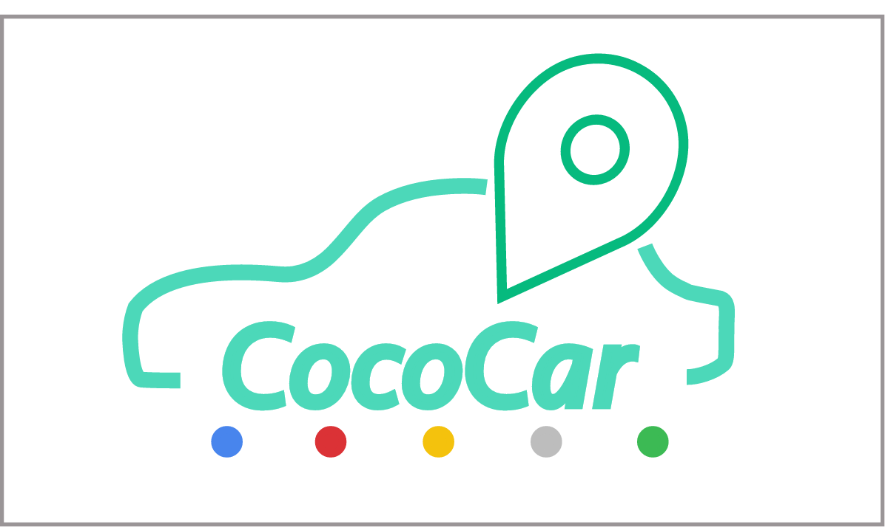

# Cococar
Google map providing live streaming of users' road condition and combining with social community.

# Welcome To Cococar
一起在地圖上直播吧！
Cococar 是一個社群地圖，讓你在世界上任何位置都可以直播、分享、和標記自己的路況資訊和交通事件，用最新的科技讓交通進化。
---

# DEMO
 Demo： http://140.115.158.81/cococar/
 

# 系統目的
塞車是許多人們的夢靨，每到連續假期時，高速公路上更是塞得水洩不通；又或是在上下班的時間，原本短短數十分鐘的路程，往往要花上將近一小時，令許多上班族十分頭痛。除此之外，社群軟體已是現代人生活中不可或缺的一部分，透過手機來與人群交流、分享資訊。因此，本系統設計Cococar更多元的資訊，為了讓使用者可以減少遇到塞車的情形，讓使用者可以事先查詢道路狀況，再來做選擇，也為駕駛人建立一個地圖社群，讓人們可以藉由地圖來交流、分享資訊。
系統會保存直播紀錄和交談資訊，譬如若有事故發生時，可以透過系統搜尋相關直播紀錄，和附近的交談資訊，提供警方和當事人有用的資訊。此外，響應近日的時代潮流“大數據”，我們的直播數據以及使用者在個地點的交談，都可以被我們所分析以及利用，或是提供給相關的單位，例如透過路段的分析，提供最佳的導航資訊。
1. 協助駕駛提前瞭解路況，令使用者得知路況，有足夠的資訊來做道路選擇，提供即時的道路資訊，令使用者不必因為對道路不熟悉，而造成行車上的不方便。
2. 本系統操作由聲控代替觸控，使駕駛視線仍可保持於前方，也響應了即時 CAR 對於行車便利的訴求。
3. 建立地圖社群，創造一個屬於駕駛人的社群，使用者可以在社群中互相交流、分享資訊。
4. 提供行車畫面紀錄，按地點及時間分類，讓使用者可以有效率的查尋。
5. 分析資料，提供最佳的導航路線

# 溝通流程設計：
#### 系統軟硬體架構如上圖所示，包括： 
1. 	智慧型動裝置 Android 系統。 
2.	網頁
3.  伺服器，內含資料庫以及直播系統server。

#### 智慧型動裝置採取GPS或網路定位，將所在經緯度傳送給遠端server，並在地圖建立標記(marker)，並且智慧行動裝置在背景程式執行一執行序(thread)向server拿取最新資料，以達廣播功效(broadcast)。
#### 以下針對智慧型動裝置其功能分述如下:
1. 	使用者登入:使用者登入可以選擇創立一使用者名稱，或採取Facebook登入，若以Facebook登入將可以整合Facebook中的社群資訊
2. 	固定標記(Fix-marker):當使用者在地圖上做固定標記，可以在此標記做留言，並且分享給地圖上所有使用者，提供即時的道路資訊
3.	浮動標記(mobile-marker):顧名思義此標記會跟隨著使用者位置而改變，並且使用者開啟直播，server廣播此標記時會含有URL，讓其他有用戶點擊浮動標記即可觀看最即時的道路資訊
4.	刪除標記:使用者可以手動刪除標記，或系統只以30分鐘內的標記最回傳，已達標記管理之目的。
5.	直播影片內存:使用者直播完畢後可將行車紀錄畫面存於裝置中，可達行車紀錄器功能，若使用者裝置容量不足，也可以存於雲端伺服。

# 資料庫系統:
#### 資料庫數據:
- 	使用者ID
- 	雜湊值根據使用者ID算出，以方便系統管理
-	直播URL(RTMP URL 直播系統採用RTMP PROTOCOL
-	留言板資訊
-	時間
-	經度，緯度
#### 經度緯度與直播URL乃此資料庫最精華的資訊，掌握此兩項資訊可以將行車紀錄畫面按道路路段做分類，讓需求行車紀錄畫面的人可以藉由此平台做出有效率的查詢，也可以提供警方做辦案。此乃延伸出網頁系統。

# 網頁:
#### 根據資料庫中直播URL以及經緯度的搭配，輸入時間和地點回傳所有相符資料。顯示於地圖上。

# 開發環境
1. Android Studio: 本系統使用Android Studio建立圖形化的使用者介面，而介面設計方式以簡單易操作為主，以符合使用者的需求。
2. Linux: 本系統使用Linux建立server，細部則可分為直播與資料庫兩大部分。 

# License 
This project is licensed under the MIT licenses

